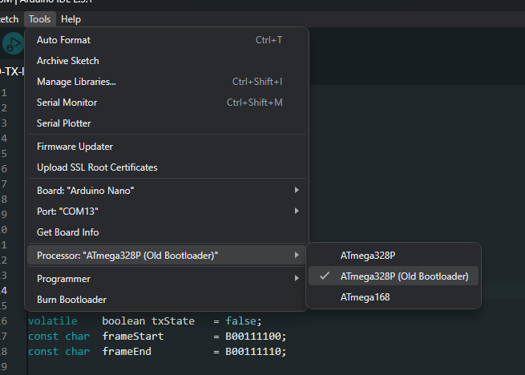
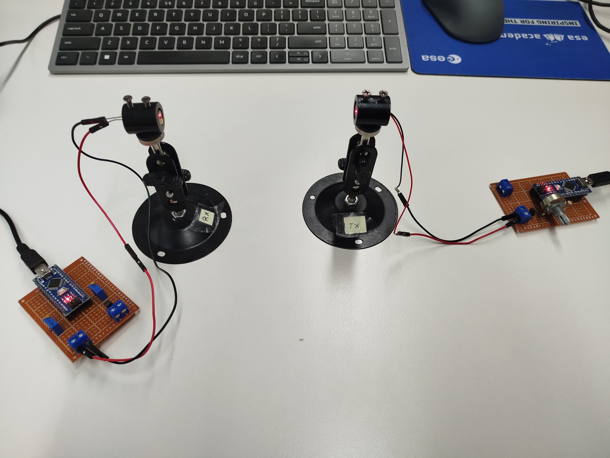

# Free Space Optical Communications on Arduino

**Description:**

This project explores the fascinating world of free space optical (FSO) communications using the Arduino platform. FSO technology enables wireless data transmission using light, offering a high-speed and secure alternative to traditional radio frequency communication.

This repository contains Arduino sketches, circuit diagrams, and documentation detailing the implementation of a basic FSO communication system. The project demonstrates the following:

- [x] **Transmitter:** Arduino-controlled laser diode for transmitting data encoded as light pulses.
- [x] **Receiver:** Arduino-based photodiode or phototransistor circuit for detecting and decoding the received light signals.
- [x] **Modulation:** Implementation of basic modulation schemes (e.g., On-Off Keying) for encoding data into light pulses.
- [] **Error Detection/Correction:**  Implementation of error detection and correction techniques to ensure reliable data transmission.

**Setup:**

1. Install Arduino IDE, configure your Arduino board accordingly, I am using Arduino Nano with old bootloader, therefore the following:

2. Connect Arduino to the PCBs as per below

3. Upload code to the Arduinos and observe message at the RX 

**Experiment:**

* Experiment with varrying RX and TX frequency
    What is the maximum TX frequency?
* Experiment with varrying TX power
    How does SNR changes varying TX power?
* Experiment with varrying payload length
    How does bandwith changes with increasing/decreasing payload length?
* Experiment with changing
    FrameStart bits
    FrameEbd   bits
    sync0Seq   bits
    sync1Seq   bits

**Components:**

* Arduino Nano
* Laser Diode (transmitter)
* Photodiode (receiver)
* Resistors (for circuit design)
* Breadboard or PCB (for building the circuit)
* Lenses (for focusing the light beam)

**Goals:**

* Gain hands-on experience with FSO communication principles and implementation.
* Explore the potential of FSO technology for various applications.
* Experiment with different modulation and error correction techniques.

**Future Development:**

* Implement more advanced modulation schemes (e.g., Pulse Position Modulation).
* Investigate the use of lasers for higher data rates and longer distances.
* Explore the integration of FSO with other wireless technologies.
* **Error Detection/Correction:** Implement error detection and correction techniques to ensure reliable data transmission.

**Credits:**

This library is a fork from https://github.com/barton-satchwill/FSOC go check out his original code!